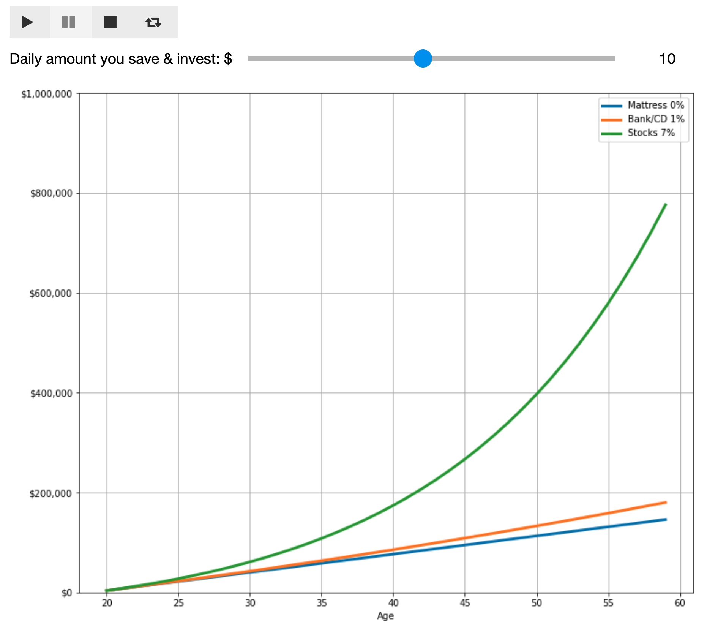
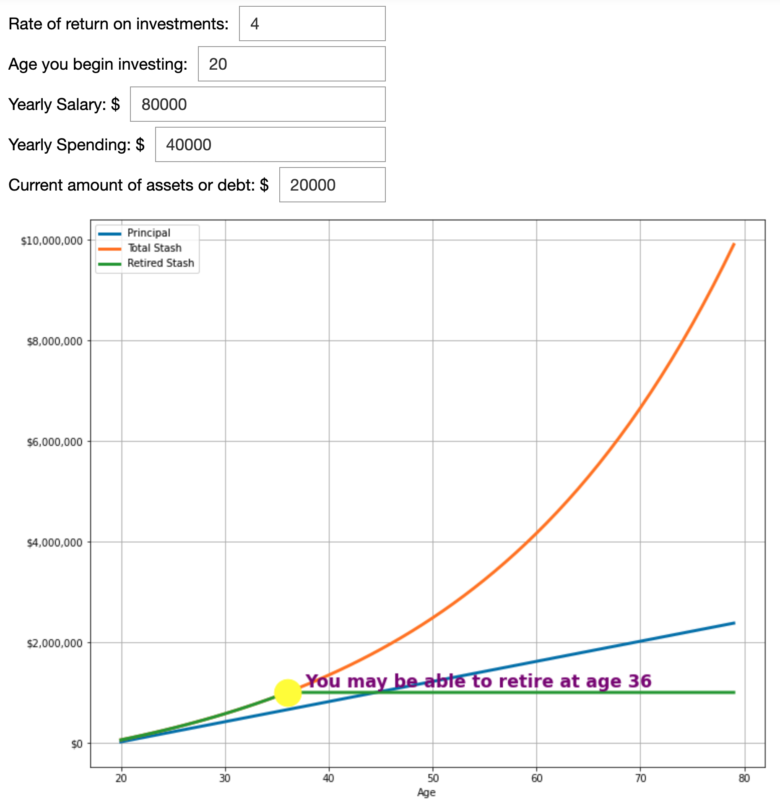

---
author:
- 'David Lippert (Data engineer & intern program manager, Leidos)'
- 
subtitle: Jupyter in Education Poster
title: How to become financially independent with interactive widgets
---

Introduction
============

Is it possible to use jupyter notebooks and interactive widgets to keep
students engaged? The short answer is yes, especially if the subject
matter can be enhanced by customizable visualizations. This summer I
setup an online session using jupyter with interactive widgets to teach
a set of interns about FIRE (Financial Independence Retire Early). I
used pandas to manage the data and matplotlib for the visualizations.
Overall, I think my notebook and lesson were greatly improved by adding
the interactive widgets. I was impressed by how easy the widgets were to
use and I recommend trying them if your subject matter can be
interactive.

Examples
--------

My lesson includes two widgets that you can try out and I hope the
examples inspire you to possibly add similar types of interactive
widgets to your own lessons.

The first example highlights the play widget. The visualization is a
graph demonstrating how compound interest can exponentially grow your
money over time. When a student hits the play button they will see what
happens to their money over 30 years if they invest \$1 a day then \$2 a
day all the way up to \$20 a day.

{width="6.6402777777777775in"
height="5.877083333333333in"}

The second example is a simple FIRE calculator that allows you to enter
several variables to determine when you can retire. The math is based on
a core FIRE concept called the 25% rule.

***If you accumulate 25 times your annual spending then you achieve
financial independence***.

The basic theory is that you should be able to live off the interest of
that stash of money forever.

{width="6.822222222222222in" height="6.9984492563429574in"}
--------------------------------------------------------------------------------

Challenges
----------

Though I am an experienced data engineer I did encounter several
challenges developing these Jupyter notebooks. Getting the interactive
widgets working was straight forward however I did not explore modifying
the layout of the widgets which might be complicated. My main challenges
involved trying to get the matplotlib visualizations to look decent and
function properly.

-   I was not able to use df.plot for my visualizations because I needed
    more control

-   Here are the main things that tripped me up with regards to
    matplotlib:

    -   Figures, axis, and subplots oh my. Stackoverflow bailed me out a
        lot.

    -   Scientific notation is not your friend when you are trying to
        make a pretty graph.

    -   Adding currency to my labels was surprisingly hard.

    -   I gave up on annotations and used ax.scatter & ax.text instead.

    -   My code needs hardening to handle a broader range of user
        inputs.

I am new to matplotlib, but it seems like it has the power to do some
very impressive visualizations if you have the patience.

Conclusion
----------

If you are up for the coding challenge and if you like to teach using
Jupyter notebooks, then try making your lessons more compelling by
adding some interactive widgets. Feel free to borrow any of my code and
see my widgets in action at \<github url\> and then play with the FIRE
calculator and see when you might be able to retire.

FIRE Resources
--------------

-   FIRE Intro on Youtube
    - <https://www.youtube.com/watch?v=8si7cqw9wm0>

-   FIRE retirement calculator
    - <https://playingwithfire.co/retirementcalculator/>

-   Mr. Money Mustache & the 4% Rule
    - <https://www.mrmoneymustache.com/2012/05/29/how-much-do-i-need-for-retirement/>

-   compound interest
    - <https://www.fool.com/how-to-invest/thirteen-steps/step-1-change-your-life-with-one-calculation.aspx>
